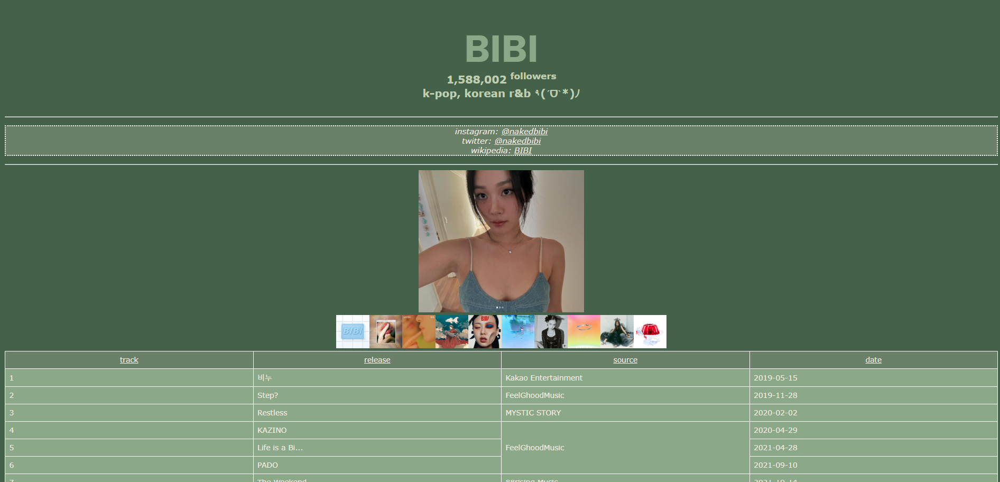
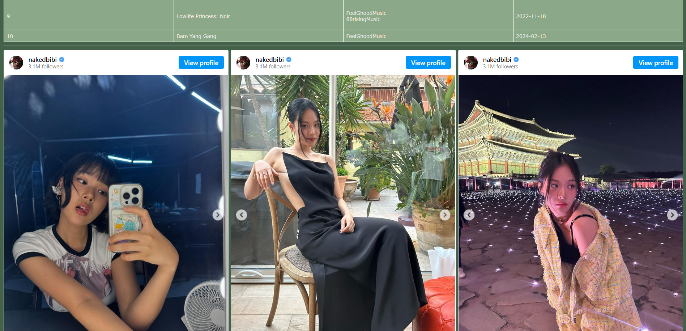

# BIBI ٩(ˊᗜˋ*)ﾉ
General webpage to help me learn introductory HTML/CSS on my own (self-study woo !!).

(Note: followers list hard coded as of 10/17/24.)

  
  

## TRACKS
Main image links to her artist profile and each sub-image link to their publication accordingly. 

Listed works aren't her entire discography but more of just my favorites, hope you enjoy!

- 1: 비누
  - 비누
  - 비누 (Clean)

- 2: Step?
  - Step?

- 3: LISTEN 035 Restless
  - Restless

- 4: KAZINO
  - KAZINO
 
- 5EP: Life is a Bi... 
  - Umm... Life
  - BAD SAD AND MAD
  - PIRI the dog
  - Birthday Cake
  - Life is a Bi...

- 6: PADO
  - PADO
 
- 7: The Weekend
  - The Weekend

- 8EP: Head In The Clouds Forever
  - Best Lover
    - 88rising, BIBI
  - froyo (feat. Warren Hue)
    - 88rising, BIBI, Rich Brian, Warren Hue 
  - T
    - 88rising, Hikaru Utada, Warren Hue

- 9ALBUM: Lowlife Princess: Noir
  - Intro
  - Blade
  - BIBI Vengeance
  - Animal Farm
  - MotoSpeed 24
  - Sweet Sorrow of Mother
  - Loveholic's hangover (feat. Sam Kim)
  - Wet Nightmare
  - Witch Hunt
  - Lowlife Princess
  - JOTTO
  - City Love

- 10: Bam Yang Gang
  - Bam Yang Gang
  - Sugar Rush

## PARAGUAY
You're probably wondering why there's a flag of Paraguay at the bottom of the webpage. I got asked to make it during a skill showcase, so I practiced it AFTER and actually did it correctly this time (oops 😍).
